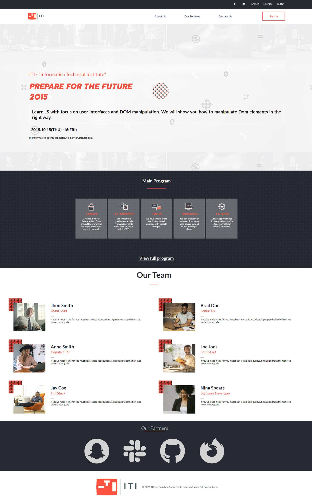

# Project Name

> Capstone project for Microverse. A webpage for a web design studio. Based on the original design by Cindy Shin on Behance. Check project here. Video introduction of project here.

Additional description about the project and its features.

## Built With

- HTML
- CSS
- Javascript

## Live Demo

[Live Demo Link](https://livedemo.com)

## Authors

👤 **Author**

- GitHub: [@oliverSCZ](https://github.com/oliverSCZ)
- Twitter: [@olivercoimbra](https://twitter.com/Olivercoimbra)
- LinkedIn: [olivercoimbra](https://www.linkedin.com/in/oliver-coimbra/)

## 🤝 Contributing

Contributions, issues, and feature requests are welcome!

Feel free to check the [issues page](https://github.com/oliverSCZ/capstone-project/issues).

## Show your support

Give a ⭐️ if you like this project!

## Acknowledgments

- Hat tip to my code partners.
- Original design by Cindy Shin on [Behance](https://www.behance.net/gallery/29845175/CC-Global-Summit-2015)

## 📝 License

This project is [MIT](./MIT.md) licensed.
